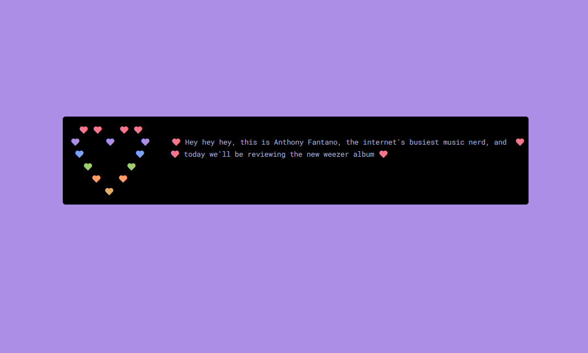

<h2 align="center"> ━━━━━━  ❖  ━━━━━━ </h2>

<!-- BADGES -->
<div align="center">
   <p></p>
   
      

      

   
   
   
   <br>
</div>

<p/>

---

### ❖ Information 

  lovesay.js is a javascript port of [lovesay](https://github.com/ZenithDS/lovesay) that displays a quote from a loved one based on the day of the month or a quote passed in via arguments. 

  

---

### ❖ Requirements

Note: These requirements only apply if using you're using lovesay.js to print a different quote for each day of the month.  

- A JSON quotes file.
- Each quote must be a new JSON list item, see the example quotes file in `.config/lovesay/quotes`.
- (optional) A partner to write you 31 lines full of love, one for each day of the month.

---

### ❖ Usage 

> a full example implementation can be found in `example.html`

lovesay.js can be used in a similar fashion to cowsay, however it differs by returning a formatted HTML object that must be written to the document body to be viewed.

```javascript
love = lovesay("Hello World");
document.write(love.outerHTML); // write the object to the document
```

if there is a quotes file loaded, lovesay.js can be used without any arguments.

```javascript
lovesayFetch(
   quotes_url=".config/lovesay/quotes.json", 
)
.then(function (data) {
   let love = lovesay('') // selects a random quote from the quotes file
   document.write(love.outerHTML);
})
.catch(function (err) {
   console.log('error: ' + err);
});
```

lovesay.js can also be used with a variety of different color schemes.

> lovesay.js uses [catppuccin](https://github.com/catppuccin) as it's default color scheme, but a different one can be specified using the `theme=` option. 

> the user must fetch the colors.json file before using a non-default theme.

For example:
```javascript
love = lovesay(''); // uses catppuccin
document.write(love.outerHTML);
```
  
```javascript
lovesayFetch(
   colors_url="lovesay/colors.json"
)
.then(function (data) {
   let love = lovesay("example", theme="nord") // uses nord 
   document.write(love.outerHTML);
})
.catch(function (err) {
   console.log('error: ' + err);
});
```

Quotes and theme JSON files can be loaded simultaneously.

For example:
```javascript
lovesayFetch(
   quotes_url=".config/lovesay/quotes.json", 
   colors_url="lovesay/colors.json"
)
.then(function (data) {
   let love = lovesay('', theme="nord"); // lovesay a quote from the file, using a non-default theme
   document.write(love.outerHTML);
})
.catch(function (err) {
   console.log('error: ' + err);
});
```

Supported color schemes as of now: 
- [catppuccin](https://github.com/catppuccin)
- [nord](https://github.com/arcticicestudio/nord)
- [dracula](https://github.com/dracula/dracula-theme)
- [gruvbox](https://github.com/morhetz/gruvbox)
- [onedark](https://github.com/joshdick/onedark.vim)
- [tokyonight](https://github.com/folke/tokyonight.nvim)
- [rose pine](https://rosepinetheme.com/)
- [ayu](https://github.com/ayu-theme)
- [palenight](https://github.com/drewtempelmeyer/palenight.vim)
- [gogh](https://github.com/Mayccoll/Gogh)

The default script fetches the quotes file using `lovesayFetch`, but if this does not occur before calling `lovesay`, and no quote is given using the function arguments, `lovesay` it will just print a heart with no quote.

---

### ❖ About lovesay.js

I wrote this port after finding the original [lovesay](https://github.com/ZenithDS/lovesay) by ZenithDS. I enjoyed the terminal functionality, but thought a JavaScript port might be useful for some users.

It was neccessary to alter how some features are implemented in this version, but I feel that the overall specification has been maintained from the original, and hope you enjoy using it.

---

<div align="center">

   

</div>
